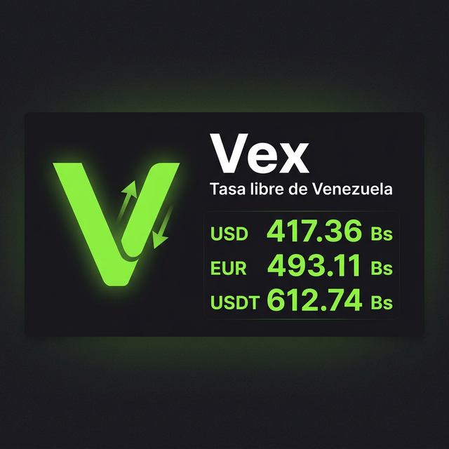

<p align="center">
  
</p>

<h1 align="center">Vex — Tasa libre de Venezuela</h1>

<p align="center">
  Consulta las tasas del dólar, euro y USDT en tiempo real.<br/>
  Rápida, sin anuncios y de código abierto.
</p>

<p align="center">
  
  
  
</p>

---

## ¿Qué es Vex?

**Vex** es una aplicación web gratuita que te permite consultar al instante las principales tasas de cambio en Venezuela:

- 💵 **Dólar BCV** — Tasa oficial del Banco Central de Venezuela
- 💶 **Euro BCV** — Tasa oficial del euro
- 🪙 **USDT** — Tasa del dólar digital (Tether)

Incluye una **calculadora de conversión** integrada: ingresa un monto en dólares, euros o bolívares y obtén el equivalente de forma automática.

## ✨ Características

| Función | Descripción |
|---|---|
| 📱 **PWA** | Instálala en tu celular como una app nativa |
| ⚡ **Rápida** | Las tasas se cachean en el servidor; la app carga en menos de 1 segundo |
| 🔄 **Actualización automática** | Se consulta la API cada 8 horas, sin necesidad de hacer nada |
| 🧮 **Calculadora** | Convierte entre USD/EUR ↔ Bolívares al instante |
| 📋 **Copiar montos** | Un toque para copiar cualquier cantidad al portapapeles |
| 📅 **Historial** | Calendario con las tasas de días anteriores |
| 🎨 **Personalizable** | Modo oscuro/claro y colores de acento |
| 📴 **Funciona sin internet** | La PWA muestra la última información disponible offline |
| 🚫 **Sin anuncios** | Experiencia limpia, sin banners ni pop-ups |

## 📸 Vista previa

<p align="center">
  
</p>

## 🚀 Instalación local

```bash
# Clonar el repositorio
git clone https://github.com/solamentepuerta/open-cambio.git
cd open-cambio

# Instalar dependencias
npm install

# Ejecutar en modo desarrollo
npm run dev
```

Abre [http://localhost:3000](http://localhost:3000) en tu navegador.

## 🏗️ Tecnologías

- **[Next.js 16](https://nextjs.org/)** — Framework de React con App Router
- **[Tailwind CSS](https://tailwindcss.com/)** — Estilos utilitarios
- **[Zustand](https://zustand-demo.pmnd.rs/)** — Estado global ligero
- **[Lucide React](https://lucide.dev/)** — Iconos SVG
- **[Cal Sans](https://github.com/calcom/font)** — Tipografía display

## 📡 Fuentes de datos

Las tasas se obtienen de APIs públicas con un sistema de respaldo en cascada:

1. **Principal** → [dolarapi.com](https://ve.dolarapi.com) (BCV, Euro, USDT)
2. **Respaldo** → [pydolarve.org](https://pydolarve.org)
3. **Último recurso** → Datos locales almacenados en caché

## 🤝 Contribuir

Las contribuciones son bienvenidas. Si quieres mejorar Vex:

1. Haz un fork del repositorio
2. Crea una rama con tu cambio (`git checkout -b mi-mejora`)
3. Haz commit de tus cambios (`git commit -m "Añadir mi mejora"`)
4. Haz push a la rama (`git push origin mi-mejora`)
5. Abre un Pull Request

## 📄 Licencia

Este proyecto es de **código abierto** y está disponible bajo la licencia [MIT](LICENSE).

---

<p align="center">
  Hecho con 💚 para Venezuela
</p>
